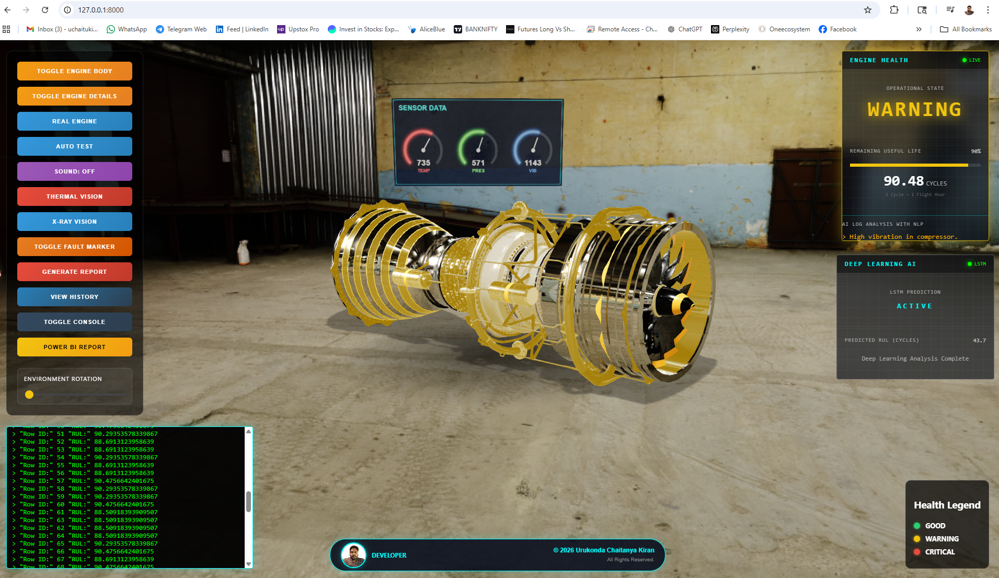
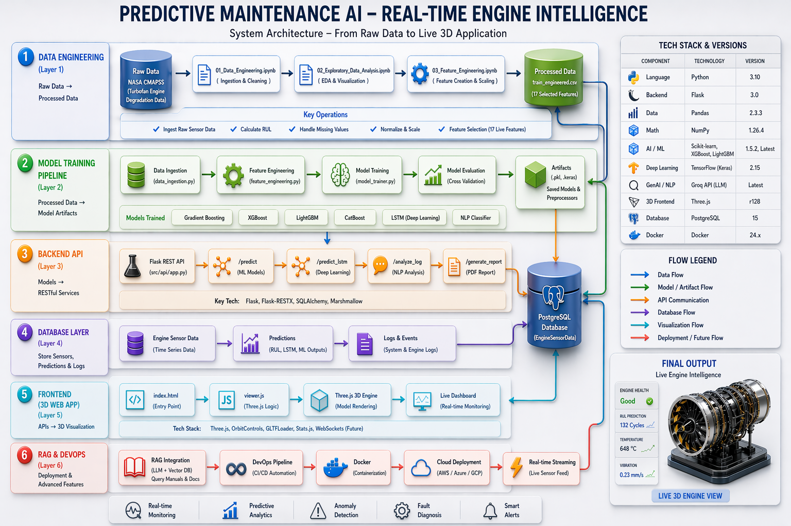

# 🚀 Predictive Maintenance AI

### Real-Time Engine Health Monitoring using ML + LSTM + 3D Visualization

---

## 📸 Live 3D Dashboard

<p align="center">
  
</p>

---

## 🧠 Project Architecture

<p align="center">
  
</p>

---

## 📁 Project Structure

```bash
Predictive-Maintenance-AI/
│
├── artifacts/
├── data/
├── notebooks/
├── src/
│   ├── api/
│   ├── components/
│   ├── pipeline/
│   ├── database/
│   └── utils/
│
├── webapp/
│   ├── index.html
│   ├── js/
│   └── css/
│
├── requirements.txt
└── README.md

⚙️ Tech Stack
 . Python 3.10
 . Flask
 . TensorFlow (LSTM)
 . Scikit-learn, XGBoost, LightGBM
 . PostgreSQL
 . Three.js

 🚀 Features
🔥 Real-time engine monitoring
🧠 LSTM-based RUL prediction
🤖 ML regression models
💬 NLP + LLM log analysis
🎮 Interactive 3D dashboard

⚡ Quick Start
git clone https://github.com/your-repo.git
cd Predictive-Maintenance-AI-Real-Time-Engine-Intelligence
python -m venv venv
venv\Scripts\activate
pip install -r requirements.txt

Run:
python -m src.pipeline.train_pipeline
python -m src.api.app

Open:
http://127.0.0.1:8000